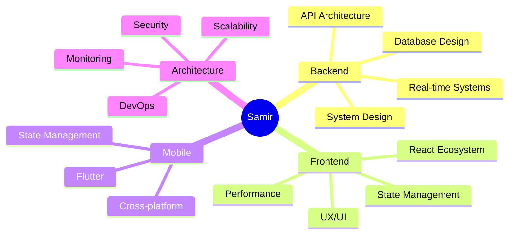

<div align="center">

# 👋 Hi, I'm Samir Ammar

### Software Engineer • System Architect • Full-Stack Developer

*I design systems before I write code.*  
*Performance, scalability, and clarity matter more than hype.*

[](https://github.com/samirammar)
[](https://twitter.com/samirammar96)
[](https://linkedin.com/in/samirammar)

</div>

---

## 🎯 About Me

```typescript
const samir = {
  location: "Egypt 🇪🇬",
  role: "Software Engineer",
  mindset: "System Design First",
  focus: ["Backend Architecture", "Real-time Systems", "Performance"],
  philosophy: "Build systems that survive real users, not just demos",
  
  approach: {
    before_code: ["Think about flows", "Model state", "Plan for scale"],
    while_coding: ["Write clear code", "Handle edge cases", "Test thoroughly"],
    after_shipping: ["Monitor behavior", "Iterate based on data", "Maintain quality"]
  }
};
```

I don't just build features — I think in **flows, states, data consistency, edge cases, and production readiness**.

---

## 🏗️ What I Build

<table>
<tr>
<td width="50%">

### 🎯 Backend Systems
- **Scalable REST APIs** with proper architecture
- **Real-time systems** (WebSockets, live data)
- **Complex business logic** (payment flows, inventory)
- **Data consistency** (ledgers, transactions, audit trails)
- **Authentication & Authorization** (roles, permissions, RBAC)

</td>
<td width="50%">

### 🎨 Frontend & Mobile
- **Complex dashboards** (filters, tables, analytics)
- **State management** (XState, React Query, Nuqs)
- **Real-time interfaces** (live updates, notifications)
- **Flutter apps** (BLoC, GetX, clean architecture)
- **Design systems** (Tailwind, ShadCN/UI)

</td>
</tr>
</table>

---

## 💼 Domains I've Shipped In

<div align="center">

| 🛒 E-commerce | 💰 Fintech | 🤖 AI Systems | 📰 Content Platforms | 🔧 Internal Tools |
|:---:|:---:|:---:|:---:|:---:|
| Custom business logic | Trading data flows | Recommendations | News delivery | Admin dashboards |
| Dropshipping | Real-time charts | Analysis engines | Content management | Workflow automation |
| Design tools | WebSocket feeds | AI integrations | SEO optimization | Data management |

</div>

---

## 🛠️ Technology Arsenal

<details open>
<summary><b>🔹 Backend & Infrastructure</b></summary>

```yaml
Languages: TypeScript, Python, JavaScript
Frameworks: Node.js, Hono.js, FastAPI, Django, NestJS
APIs: REST, WebSockets, GraphQL
Databases: PostgreSQL, MySQL, MongoDB, Redis
ORMs: Drizzle, Prisma, TypeORM
Tools: Docker, Linux, Git, CI/CD
```

**Key Skills:**
- 🔐 Authentication & authorization systems
- 📊 Database design & optimization
- ⚡ Real-time messaging & events
- 🔄 State management & consistency
- 📈 Performance optimization

</details>

<details>
<summary><b>🔹 Frontend & UI</b></summary>

```yaml
Core: React, Next.js, TypeScript
Styling: Tailwind CSS, ShadCN/UI, Radix UI
State: React Query, XState, Zustand, Nuqs
Tools: Vite, Turbopack, ESLint, Prettier
```

**Key Skills:**
- 🎨 Complex UI/UX flows
- 📱 Responsive & adaptive design
- ⚡ Performance optimization
- 🔄 Real-time updates
- ♿ Accessibility & UX

</details>

<details>
<summary><b>🔹 Mobile Development</b></summary>

```yaml
Framework: Flutter (Web & Mobile)
State: BLoC, GetX, Provider
UI: Material Design, Custom widgets
Features: Offline-first, Real-time sync
```

**Key Skills:**
- 📱 Cross-platform development
- 🎯 State management patterns
- 🔄 Data synchronization
- 💾 Local storage & caching

</details>

<details>
<summary><b>🔹 System Design & Architecture</b></summary>

**I Think About:**
- 🏗️ Scalability & performance
- 🔒 Security & data integrity
- 🔄 Race conditions & edge cases
- 📊 Data modeling & relationships
- 🎯 Business logic & workflows
- 🐛 Debuggability & observability
- 📈 Monitoring & metrics

</details>

---

## 🧠 My Engineering Philosophy

<table>
<tr>
<td width="33%">

### 🎯 Clarity Over Cleverness
Write code that others can understand and maintain

</td>
<td width="33%">

### 🔒 Data Correctness
Consistency, integrity, and audit trails matter

</td>
<td width="33%">

### 📊 Production Ready
Build for real users, not just demos

</td>
</tr>
</table>

> **I care less about frameworks, more about whether the system survives real users.**

**What I Value:**
- ✅ Predictable behavior
- ✅ Observable systems
- ✅ Debuggable code
- ✅ Maintainable architecture
- ✅ Clear documentation
- ✅ Thoughtful error handling

**What I Avoid:**
- ❌ Over-engineering
- ❌ Premature optimization
- ❌ Framework hype-chasing
- ❌ Magic that's hard to debug
- ❌ Technical debt without reason

---

## 📈 GitHub Stats

<div align="center">


</div>

---

## 🏆 Achievements & Highlights

<div align="center">


</div>

---

## 🎓 Learning & Growth



**Currently Exploring:**
- 🦀 Rust for performance-critical systems
- 🔥 Advanced PostgreSQL patterns
- 🎯 Event-driven architectures
- 📊 System observability & monitoring
- 🧪 Advanced testing strategies

---

## 💡 Featured Projects & Work

<table>
<tr>
<td width="50%">

### 🎯 Real-time Trading Platform
- WebSocket-based live data feeds
- Complex state management
- High-performance charting
- Real-time notifications

**Tech:** React, WebSockets, XState, PostgreSQL

</td>
<td width="50%">

### 🛒 E-commerce System
- Multi-vendor platform
- Custom design tools
- Payment processing
- Inventory management

**Tech:** Next.js, Drizzle ORM, Redis, Stripe

</td>
</tr>
<tr>
<td width="50%">

### 📊 Admin Dashboard Suite
- Complex filtering & search
- Real-time analytics
- Role-based access control
- Export & reporting

**Tech:** React, Tanstack Table, React Query

</td>
<td width="50%">

### 📱 Flutter Mobile App
- Offline-first architecture
- Real-time synchronization
- Clean architecture pattern
- Material Design 3

**Tech:** Flutter, BLoC, Drift, Firebase

</td>
</tr>
</table>

---

## 📬 Get In Touch

<div align="center">

[](mailto:samirammar.officially@gmail.com)
[](https://twitter.com/samirammar96)
[](https://linkedin.com/in/samirammar)

</div>

<div align="center">

### 🔗 Coding Profiles

[](https://www.hackerrank.com/samirammar)
[](https://www.leetcode.com/samirammar)

</div>

---

## 💬 Let's Talk About

- 🏗️ System architecture & design patterns
- ⚡ Performance optimization strategies
- 🔒 Security & data integrity
- 📊 Database design & optimization
- 🎯 Product development & business logic
- 🧪 Testing strategies & quality assurance
- 📈 Scaling applications & infrastructure

**Open to:**
- 💼 Interesting projects & collaborations
- 🤝 Technical discussions & knowledge sharing
- 🎯 Consulting on architecture & design
- 📚 Mentoring & code reviews

---

<div align="center">

### 📊 This Week's Coding Activity

<!--START_SECTION:waka-->
<!--END_SECTION:waka-->

---

### ⚡ Recent Activity

<!--START_SECTION:activity-->
<!--END_SECTION:activity-->

---


**Thanks for visiting! 👋**

*"Design systems that are predictable, observable, and debuggable."*

</div>
